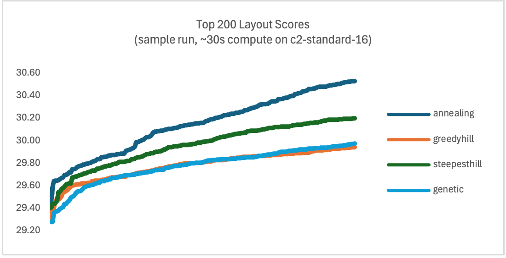

# Jalo: just another layout optimizer

Jalo is an interactive keyboard layout analyzer and optmizer, with the following capabilities;

* *Flexible number of keys*: Jalo can analyze keyboards with any number of keys and physical configurations, including keys on thumbs, any number of pinky or central columns, extra rows, keys on layers, and more. 
* *Powerful optimization*: Optimization features can generate a wide range of layouts, improve existing layouts, and fine tune them by suggesting the most promising swaps. Under the hood, Jalo combines simulated annealing, genetic algorithms, and different flavors of hill climbing depending on the job.
* *Your own scoring function*: To score layouts, Jalo allows any (linear) combination of metrics with user-defined weights, and makes it simple and interactive to change them. Jalo also provides clear reporting on how each metric contributes to each layout's final score, so it's easy to understand how to improve both. 
* *Your metrics*: Most of the metrics in the [Keyboard layout doc](https://docs.google.com/document/d/1W0jhfqJI2ueJ2FNseR4YAFpNfsUM-_FlREHbpNGmC2o) are included, but the definitions of the metrics can be changed, and new metrics can be added. Jalo makes it easy to analyze layouts, identify what key combiniations are contributing to any metric, and compare layouts side-by-side. 
* *Editing*: Editing layouts is simple, with commands to mirror and invert layouts, and swap pairs of keys.

Jalo works as a command line tool with an interactive mode (REPL), or by invoking it with commands or a script file. Start the interactive mode `./jalo.py` then type `help` to get a list of commands. Use tab to auto-complete command names and arguments, and up/down to cycle through command history.

## Installation

To install, clone this repo, then use pip to install dependencies (see `pyproject.toml` if you want to inspect them).

```bash
git clone https://github.com/tiagowright/jalo
cd jalo
pip install .
```

## Usage

Once installed, you can use Jalo by invoking it from the command line:

```bash
./jalo.py
```

At the prompt `jalo> `, type `help` for an overview of all available commands, and `help <command>` for details on each command. Use arrows up/down to cycle through your command history. Tab is auto-complete, and it will complete commands as well as arguments, including completing layout names, metric names, etc.

The typical workflows are to `analyze` and `compare` layouts, or to `generate`, `improve`, `polish`, modify layouts (e.g. `swap`) for your needs. In the sections that follow, we'll cover these in more depth.


## Analyzing layouts

Jalo analyzes layouts and reports on 30+ common metrics, plus finger-level metrics. Use `analyze` to see how a specific layout fares against all metrics, along with the key sequences that are the most impactful on that metric. For example, `analyze enthium` shows that `sfb` is 0.795% and that the worst offender is `ue` at 0.128% frequency in English.

```
jalo> analyze enthium

enthium                      ortho_pinky_33
---------------------------  ----------------------------
|   z p d l x   = u o y q    |    0 1 2 3 3   6 6 7 8 9
| w s n t h k   - e a i c b  |  0 0 1 2 3 3   6 6 7 8 9 9
|   v f g m j   ; / . , '    |    0 1 2 3 3   6 6 7 8 9
|           r                |            4

metric                     enthium  top n-gram
                    ortho_pinky_33
----------------  ----------------  -------------------------------------------------
rep                          2.742  ll: 0.713, ee: 0.412, ss: 0.353, oo: 0.295
sfb                          0.795  ue: 0.128, y,: 0.104, oa: 0.074, nf: 0.059
sfs                          5.795  dt: 0.491, gt: 0.454, ue: 0.434, oa: 0.326
sft                          0.007  e-e: 0.002, e-u: 0.001, ue-: 0.001, ueu: 0.000
...
```

You can also compare multiple layouts on all metrics with `compare`. For example, `compare graphite sturdy` will quickly show that graphite has more `alt_sfs` but lower redirects. 

```
jalo> compare graphite sturdy
metric              graphite  Δ      sturdy  Δ
                        ansi           ansi
----------------  ----------  ---  --------  ---
...
same_hand              6.510  -       9.493  +
alt                   37.295  +      31.755  -
alt_sfs                4.854  +       3.898  -
alt_total             42.149  +      35.654  -
...
redirect               2.037  -       3.338  +
redirect_sfs           0.549  -       1.569  +
redirect_bad           0.283          0.212
redirect_bad_sfs       0.114          0.110
redirect_total         2.983  -       5.229  +
...
```

You can also change the corpus being used to assess the metrics using the `corpus` command, for example, to assess layouts on different language, or to use your own corpus (see [Corpus section](#corpus)).


## Layouts

Jalo ships with a number of layouts, all available in `./layouts/` folder. You can also use tab to auto-complete layout names to get a list:

```
jalo> analyze 
asto       colemak    dvorak     enthium    graphite   hdneu      hdti       isrt       qwerty     sturdy    
asto_22    colemak_dh engram     gallium    hdgold     hdpm       inrolly    mtgap      semimak    workman   
```

Creating your own layout is easy. You can add a `.kb` file in the `./layouts/` folder using a text editor (use any of the existing files there as examples). 

You can also create layouts in Jalo, for example, using `generate` or by editing an existing layout with `swap`, `mirror`, `invert`, and so on. Layouts created in jalo are kept in memory and can be accessed by their number (use `list` command to see what is in memory). If you are happy with a layout, you can use `save` to create a new file in the `./layouts/` folder that can be referenced later, edited by hand for any additional changes, shared, etc.

```
jalo> invert hdpm

layout 2 3004.163 (30.686)  > invert hdpm
v w g m j   - . ' = / z
s n t h k   , a e i c q
f p d l x   ; u o y b  
        r            

jalo> save 2 hdpm_inverted
saved layout to layouts/hdpm_inverted.kb
```

Layout files can optionally name the hardware to be used for the layout. Many layouts are created using a 3 x 10 grid of 30 keys that are compatible with `ansi` or `ortho` hardware. When a layout is needed, jalo tries to load it into the default hardware, typically `ansi` or `ortho`. You can change the default with the `hardware` command, or by editing the `config.toml` file to change it for all future sessions.

But you may be interested in adding thumb letter keys, more keys to the pinky finger, removing keys, adding layers, etc. Layouts that are not compatible with the 3 x 10 grid can name the hardware setup to be used for that layout by adding a comment with a hint, for example, `# use: ortho_thumb` will tell jalo to use `ortho_thumb` hardware for this layout (see `hdpm.kb` for an example).

See [Keebs](#keebs) section for more information about customizing the hardware, and [Defaults](#defaults) to change the default hardware.

## Keebs

Jalo supports a variety of keyboard hardware with different numbers and arrangements of keys, available in the `./keebs/` folder, including:
* `ansi`: the standard 30 key, row staggered, setup common to most laptops, and the most widely used for layout designs
* `ortho`: the analogous 30 key orthonormal setup (no stagger), that is compatible with `ansi` so that any layout built for one can be easily transposed on the other
* `ansi_angle`: this is the standard `ansi` setup with an "angle mod", where the typist uses a different set of fingers for the bottom row on the left hand
* `ortho_thumb`: the `ortho` setup with an additional key on the left thumb that can assigned a letter/character, for layouts like Hands Down series

Jalo shows layouts and the hardware they are loaded on side by side. The hardware shows the fingers that are assigned to each position, from the left pinky at 0 to the right pinky at 9.

```
jalo> show qwerty

qwerty                   ansi
-----------------------  --------------------------
| q w e r t   y u i o p  |  0 1 2 3 3   6 6 7 8 9
| a s d f g   h j k l ;  |   0 1 2 3 3   6 6 7 8 9
| z x c v b   n m , . /  |    0 1 2 3 3   6 6 7 8 9

jalo> hardware ortho
Updated hardware to: ortho
jalo> show graphite

graphite                 ortho
-----------------------  ------------------------
| b l d w z   ' f o u j  |  0 1 2 3 3   6 6 7 8 9
| n r t s g   y h a e i  |  0 1 2 3 3   6 6 7 8 9
| q x m c v   k p . - ,  |  0 1 2 3 3   6 6 7 8 9

jalo> show hdpm

hdpm                       ortho_thumb_33
-------------------------  --------------------------
| f p d l x   ; u o y b z  |  0 1 2 3 3   6 6 7 8 9 9
| s n t h k   , a e i c q  |  0 1 2 3 3   6 6 7 8 9 9
| v w g m j   - . ' = /    |  0 1 2 3 3   6 6 7 8 9
|         r                |          4

jalo> show inrolly

inrolly                  ansi_angle
-----------------------  --------------------------
| y o u q x   k d l w ,  |  0 1 2 3 3   6 6 7 8 9
| i a e n j   v h t s c  |   0 1 2 3 3   6 6 7 8 9
| " - r b z   f p m g .  |    1 2 3 3 3   6 6 7 8 9
```

To create your own hardware setup, add a file to the `./keebs` directory that exports a `KEYBOARD` attribute. The exported object needs to be an instance of `hardware.KeyboardHardware`. The simplest way is to modify the ansi/ortho setup by adding or modifying keys (e.g. see `ortho_pinky_33`). If you must / want to start from scratch, use `ansi` or `cr8` as examples for the approach. Once the file is created, you can refer to the keyboard by the file's name in Jalo.


## Metrics

The metrics were carefully created to match as closely as possible the definitions in the [Keyboard layout doc](https://docs.google.com/document/d/1W0jhfqJI2ueJ2FNseR4YAFpNfsUM-_FlREHbpNGmC2o) and to work with a wide range of different hardware configurations. Use the `metric` command to review the metrics and their descriptions.

```
jalo> metrics
Metric            Description
----------------  ------------------------------------------------------------------------
rep               single finger repetition
sfb               single finger bigram
sfs               single finger skipgram
...
```

You can also inspect, update, or create your own metrics. All metrics are defined in `metrics.py`. Metrics are defined as a method that takes either 1, 2, or 3 key positions, and returns a floating point value. You can inspect the definitions and modify the functions to better align with your preferences if needed. For instance, `scissors` are especially difficult to define, and you may have different preferences for what should be included or not.

To create your own metric, add a new function to `metrics.py`, then add your new metric to the `METRICS` array at the end of the file. Copy the patterns of an existing metric that is of the same type. If you define a new trigram based metric (three position inputs), it may be worth thinking about efficiency in your code, since these are computed for every combination of 3 positions on the keyboard you are analyzing (`O(N^3)`). After defining your metric, use `analyze` to check on the most common key combinations to inspect the quality of the definition.


## Editing layouts

Jalo provides a number of functions to quickly edit layouts in the interactive shell:
* `swap`: swap two or more positions
* `mirror`: horizontal mirroring, basically swap left and right hands
* `invert`: vertical mirroring, swap top and bottom rows (for one or both hands)

```
jalo> invert hdpm

layout 1 3004.163 (30.686)  > invert hdpm
v w g m j   - . ' = / z
s n t h k   , a e i c q
f p d l x   ; u o y b  
        r            
```


## Scoring layouts

The "magic" in optimizing layouts using most computer optimization tools is figuring out how to score them. The workflow often involves coming up with a way to score layouts (such as setting a bunch of weights), running the optimization, then tweaking the weights again to improve the outputs. Jalo makes it easier to understand how the current score is calculated and what drives it, and then simple to update the scoring function.


In Jalo, the score is an amount of *effort*, so that lower scores are always considered better. Jalo allows any weighted combination of any of it's metrics to create a score. Typically, this is a combination of positive weights, indicating increased effort, for metrics such as `sfb`, `sfs`, `scissors`, `redirect`, and negative weights, indicating reduced effort, for metrics such as `in_roll`, `home`, `alt`. This combination of weights into a single score is called an "objective".

Jalo ships with some objectives that are available in `./objectives`. Use the `objective` command to name one of these as your objective function (e.g., `objective default` for the "default" function), or update `config.toml` to change the default for all future sessions as well.

Jalo makes it easy to create your own objectives. Use the `objective` command to view the current objective, and to make updates to the weights, add / remove metrics, etc, directly in the interative shell.

```
jalo> objective
Current function:
objective 100sfb + 6heat + 60pinky_ring + 60scissors_ortho + 60sfs + 20finger_0 + 20finger_9 + 18finger_1 + 18finger_8 + 15finger_2 + 15finger_7 + 12finger_3 + 12finger_6

jalo> objective 100sfb + 60sfs + 60pinky_ring
Updated function to:
objective 100sfb + 60sfs + 60pinky_ring
```

If you have a good objective function, you can also save it, and use it in the future, or set it as the default. Create a new `.toml` file in `./objectives` with the name you want. The toml file must follow one of these two conventions:

* Have a key called `formula` with a string that contains the same format of formula that the `objective` command supports (e.g., `default.toml`)
* Have a `formula` table, where each key is the name of a metric, and the value is the weight assigned to that metric (e.g., `oxeylyzer.toml`)

Jalo makes it much easier to understand how the layouts you are building are getting scored, in detail. A tricky step in improving the objective can be just understanding why it is leading to some layouts that are not great, what weights are driving it there. Jalo provides `contributions` command, which breaks down how each weight and metric contributes to the score, comparing multiple layouts side-by-side. 

In this example, layout `1.1` is compared with `hdpm` and `graphite`, with the score weights shown in `w`, and the contributions to the score for each metric and layout in the `ΔS` columns, showing that `sfs` in this case is one of the drivers of the differences in score.

```
jalo> contributions 1.1 hdpm graphite
metric                  w               1.1  Δ          ΔS              hdpm  Δ          ΔS    graphite  Δ          ΔS
                             ortho_thumb_33                   ortho_thumb_33                       ansi
----------------  -------  ----------------  ---  --------  ----------------  ---  --------  ----------  ---  --------
rep                                   2.742                            2.742                      2.741
sfb               100.000             0.906         90.626             0.828         82.792       0.996         99.557
sfs                60.000             5.162  -     309.722             6.653  +     399.162       6.260        375.571
...
score                                             2657.097                         2973.477                   3030.263
```

## Generating layouts

Jalo provides multipe optimization commands to create new layouts:
* `generate`: creates a wide variety of layouts that are different from each other, exploring widely for very different layouts that score well
* `improve`: starts from a specific layout and improves it, exploring intensely in the neighborhood of the given layout to immprove the score
* `polish`: suggests a small number of swaps that improve the score of a layout

The general workflow is to start with an objective (score function), use `generate` to identify promising ideas, and iterate by modifying the objective and generating layouts. Once a promising layout is found, `improve` is used to refine it, iterating with further changes to the objective if needed. Finally, `polish` is used to suggest further swaps that might be helpful in improving the score.

```
jalo> generate
generating 100 seeds.
Generating: 100%|██████████████████████████████████████████████████████████████████████████████████████████████████████████████████| 100/100 [00:22<00:00,  4.41it/s]

layout list 1 > generate

layout 1.1 2923.780
g v n h k   ; o e y -
c t r d p   , a u i s
w m l f b   q . ' j x

layout 1.2 2930.505
- g m p b   q l a , ;
s c t h f   x n o i e
y w v d k   j r . u '
```

You can control how much compute to put into generate by changing the number of seeds: `generate 10` is faster, `generate 200` takes longer. In practice, I find that 200 is typically enough to find good results.

After generation, a new list of layouts is created in memory. In the example, list `1` was created, and layouts `1.1`, `1.2` and so on added. You can refer to layouts by these numbers in any command that accepts a layout name (e.g., `contributions 1.1 1.2`). Use the `list` command to see what is in memory, and `save` to save a good layout to a file.

You can control the hardware, objective, and corpus used for generation with `hardware`, `objective`, and `corpus` commands, or by updating `config.toml` to change the defaults for all future sessions.

Another way to control the hardware used, is to name an existing layout as an argument. For example `generate 100 hdpm` will use the same hardware and set of characters as `hdpm`.

You can also control where some keys will be placed by pinning them first, and naming a layout that has them. For example, if you want to have the same vowel block as `graphite`:

```
jalo> pin aeiou
pinned: a e i o u

jalo> generate 100 graphite
generating 100 seeds.
Generating: 100%|██████████████████████████████████████████████████████████████████████████████████████████████████████████████████| 100/100 [00:10<00:00,  9.23it/s]

layout list 3 > generate 100 graphite

layout 3.1 2937.478
z g m p b   q l o u -
s c t h f   x n a e i
y w v d k   j r . ' ,
```

## Improving and Polishing

Improving and polishing optimizations work similarly to `generate` (read [Generating Layouts](#generating-layouts) first), leveraging the objective to identify ways to make the score better for a specific layout. The workflow is similar, iterating between running `improve` or `polish`, and potentially `objective` to fine tune the score. Use `pin` to pin characters to positions, and `swap` to apply manual changes. To improve scoring itself, use `contributions` and `compare`.

```
jalo> pin snth aeiou
pinned: s n t h a e i o u

jalo> improve hdpm
improving hdpm with 100 seeds.
Improving: 100%|███████████████████████████████████████████████████████████████████████████████████████████████████████████████████| 100/100 [00:03<00:00, 28.18it/s]

layout list 1 > improve hdpm

layout 1.1 2819.187 (-154.290)
x p d l k   ; u o y ' q
s n t h f   , a e i c w
v b z m j   - . / = g  
        r                       
...
```

```
jalo> polish hdpm
1 swaps:
------------  ----------------
swap hdpm qg  # score: 2889.09
swap hdpm g/  # score: 2908.89
swap hdpm kg  # score: 2914.76
swap hdpm gj  # score: 2915.54
swap hdpm xg  # score: 2917.06
...

3 swaps:
-------------------  ----------------
swap hdpm g/ qw bq   # score: 2856.98
swap hdpm qg b/ wb   # score: 2857.98
swap hdpm qg fx dl   # score: 2862.01
swap hdpm qg pb p/   # score: 2862.97
...
```

## Corpus

When analyzing a layout, the corpus determines how often key sequences of a layout will be typed, and thus it is a critical driver of all the results. For example, the `en` corpus (the default English language corpus) specifies that the sequence of letters `ed` will be typed 0.99% of the time, and therefore, on a qwerty layout, where `e` and `d` are both on the left middle finger, it drives the `sfb` metric (single finger bigram) up by that amount.

Jalo corpuses are provided in the `./corpus` directory, including the most commonly used corpus for english language optimizations. To select a corpus, use the `corpus` command, or to avoid repeating the command, change the default corpus in `config.toml` ([see Defaults section](#defaults))

To provide your own corpus, create a new folder under `./corpus` named for the new corpus. The folder should contain 4 json files: `monograms.json`, `bigrams.json`, `trigrams.json`, `skipgrams.json`, that specify the frequency of each ngram in the corpus. The values in each file should add up to 1.0 (i.e., should be frequencies, not counts). Additional files can be added for more information about the corpus, and will be dutifully ignored.

Creating a great corpus can be tricky to get right. You want to the corpus to be closely representative of what you will be typing, and large enough to provide robust statistics within a tenth of a percent or better. The corpus also needs to be cleaned, for example, by dealing with capitalization, accented characters, special characters that are shifted, and so on. I would recommend using an existing corpus, either provided here, or from one of the other layout optimization projects listed in references, if possible.

## Defaults

Default values are loaded from `config.toml` and define the default hardware, corpus, and objective function that will be used. These can later be changed with `hardware`, `corpus`, and `objective` commands, but it's worth editing the file to put in your preferred values and avoid having to set them each time.

The config also allows you to set the `oxeylyzer_mode` flag, which will force Jalo to use metric definitions that match exactly with the definitions in [Oxeylyzer](https://github.com/o-x-e-y/oxeylyzer/), where ever possible. Where the Jalo definition is different, it is only because I believe it is a better reflection of what is described in the [Keyboard layout doc](https://docs.google.com/document/d/1W0jhfqJI2ueJ2FNseR4YAFpNfsUM-_FlREHbpNGmC2o), but you may have a different opinion (see Metrics section as well).


## Under the hood: Simulated Annealing, Genetic Algorithm, and Hill Climbs

Jalo uses different "solvers" to optimize layouts in different scenarios. As a user, you probably don't need to worry about this, but for those interested in diving deeper, this section offers a brief overview.

The core problem in layout optimization is finding the assignments of characters to physical keys that minimizes the objective (that is, typing effort). If there are 30 keys, the space of possibilities is 30 factorial, about 10^32 different layouts, which is simply too many to check one by one (brute force). Thus we need some other approach that allows us to find promising layouts among the wide sea of options.

Jalo leverages four approaches. The basic approach is the *steepest hill*: start with a random layout, then check every possible swap, and "accept" the one that improves the score the most, then rinse and repeat, until no more swaps are found that improve the layout. This is fast to converge, but may get stuck on "local minima", that is, layouts where a single swap makes no improvement, but far from the best possible.

A simple, yet surprisingly effective work around is the *greedy hill* approach: start with a random layout, then check possible swaps in random order, and "accept" the first swap that improves the score at all, and continue this way until no further swaps are found to improve things. To avoid "local minima", go back to the original seed layout and run the same algorithm again, re-randomizing the sequence of swaps.

A more sohpisticated approach is *simulated annealing*: as with the steepest hill approach, check all swaps, "accept" the best one, and repeat. But when no more swaps improve the score, "accept" a swap that makes it worse, with a probability that is proportional to the "temperature". Iterate, while reducing the temperature, until no more swaps are accepted.

Finally, Jalo also uses *genetic algorithm*: start with a random population of layouts, and run the steepest hill on all of them, so none can be improved further in this way. Now pick two "parents" from this population at random (giving a higher probability to better scoring layouts). Combine the two "parents" into a new layout "child", then improve that child using the steepest hill approach. Add the child to the population, then iterate to the next generation, until you run out of generations.

In practice, I found that the genetic algorithm tends to deliver the best population of layouts, for the same amount of compute used, while the naive "greedy hill" approach comes as pretty close second. To assess the quality of the results, I first cluster the population to eliminate layouts that are very similar to each other, then look at the area under the curve of the score. The genetic algorithm seems to consistently deliver better scores in top 200 layouts generated, and especially seems to provide better top 10 results.

However, if what you want is to explore near a reference layout, then simulated annealing seems to be the best option. The annealing process visits many layouts within 5 swaps of the seed very efficiently, providing higher density of good layouts.

Here's an example run comparing the layout score curves for the four different approaches. Each run used ~30s of compute on a c2-standard-16.



Given these (adimitedly not totally robust) results, Jalo leverages the genetic algorithm for `generate`, simulated annealing for `improve`, and steepest hill for `polish`.

In practice, other optimizations are needed. First is to do full column swaps, in addition to single position swaps. All algorithms implement incorporate both types of swaps. The second is to optimize the code that computes the score after a swap, as this is the bottleneck for performance. In jalo, this function is implemented as a delta calculation that runs in O(N^2) instead of O(N^3) that would be needed for a full score compute, and the function is optimized with `numba`, and compiled into machine code. Third, is parallelization: Jalo will leverage all available CPUs for an optimization run in parallel.

To go deeper, the entry point is `optim.py`, the algorithms are implemented in `./solvers/`, parameter tuning settings in `./solvers/tuning`, and some of these tuning runs results are available in `./solvers/logs`.


## References

Thank you to the Keyboard layout communities for your help and inspiration over the years. 

The following projects speficically were fundamental inspiration and sources of ideas for Jalo:
* [Keyboard layout doc](https://docs.google.com/document/d/1W0jhfqJI2ueJ2FNseR4YAFpNfsUM-_FlREHbpNGmC2o)
* [carpalx](https://mk.bcgsc.ca/carpalx/)
* [oxeylyzer](https://github.com/o-x-e-y/oxeylyzer/)
* [keygen](https://github.com/xsznix/keygen)
* [keymui](https://github.com/semilin/keymui)
* [cmini](https://github.com/Apsu/cmini)
* [colemak](https://colemak.com/Design)
